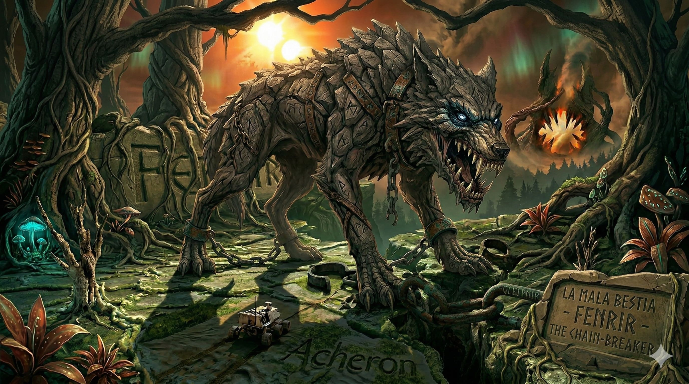

# AEGIS — The Crystal Labyrinth v14: FENRIR — "The Viking Wolf"

> *"Si entras no sales. One way ticket. Smile."*



**AEGIS FENRIR** is a post-quantum cryptographic adaptive-behavioral oracle built on the projective geometry PG(11,4). It wraps the complete [ACHERON v2](https://github.com/tretoef-estrella/AEGIS-The-Crystal-Labyrinth-V13-ACHERON-The-Desert-of-Agua-Seca) resource-drain oracle — itself wrapping AZAZEL's 7 Hells and GORGON's 7 Venoms — with **8 Mordidas** (the wolf's fangs), **M13: The Blood Eagle**, a **Viking Frost** amplification system, and full **Aikido** reflection of the attacker's own tools against them.

ACHERON drained the attacker's will. FENRIR **learns their strategy, turns it into a weapon, and executes them with it.**

The attacker enters the labyrinth. The forest watches. The forest learns. The forest bites.

---

## At a Glance

| Metric | Value |
| --- | --- |
| Geometric space | PG(11,4) via Desarguesian spread PG(5,16) |
| Points (full scale) | 5,592,405 |
| Security (classical) | GL(12,4) = **287 bits** |
| Security (post-quantum) | **>2^200** after Grover adjustment |
| GORGON heritage gap | **0.0013** (statistical invisibility) |
| Oracle gap (under full assault) | **0.0300** |
| Defense layers | **7 Hells + 12 Desiccations + 8 Mordidas + DEL + Frost + Aikido** |
| Judas contradiction rate | **0.776** (77.6% — new record) |
| Friend verification | **500/500** (100% — sacred, untouched) |
| Replay isolation | **2/200** (near-perfect) |
| Epoch coupling | **0/50** (offline simulation: total divergence) |
| Blood Eagle executions | **2,147** strikes at rank ≥ 11 |
| Frost amplifier | **51.3×** accumulated cold |
| Aikido reflections | **469** — attacker's queries used as venom |
| Speed | **0.136 ms/query** (pure Python 3, zero dependencies) |
| Runtime (full test battery) | **4.4 seconds** |
| Auditor consensus | **3/3 GO** — Gemini 9.8 · ChatGPT 9.3 · Grok 9.7 |
| Predecessor | [ACHERON v2](https://github.com/tretoef-estrella/AEGIS-The-Crystal-Labyrinth-V13-ACHERON-The-Desert-of-Agua-Seca) "The Desert of Agua Seca" (Beast 5) |
| Classification | Beast 6 — Phase III: Drain |

---

## The Labyrinth Forest

FENRIR is not a desert. It is a **living labyrinth** — a Nordic forest where the topology changes based on the explorer. Three environments merge into one:

| Environment | What It Represents | What It Does |
| --- | --- | --- |
| **The Gleipnir Web** | Behavioral fingerprinting | The forest watches every step, classifies the intruder's tools, adapts its traps |
| **The Frost** | Accumulated entropy | The cold intensifies with every query — each wound burns more than the last |
| **The Blood Eagle** | Ritual execution | When the attacker believes they've won, the eagle descends |

---

## The 8 Mordidas (The Wolf's Fangs)

On top of the 7 inherited Hells and 12 inherited Desiccations, FENRIR adds:

| Mordida | Codename | What It Does |
| --- | --- | --- |
| **M1** | Gleipnir | Attack fingerprinting with inertia — classifies ISD, Gröbner, Lattice, Hybrid solvers |
| **M2** | Colmillo de Tÿr | Softmax venom blending — ALL venom types applied simultaneously, weighted by confidence |
| **M3** | Memoria del Lobo | 4-phase psychology: Observation → Taste → Conviction → Execution (adaptive boundaries) |
| **M4** | Gleipnir Inverso | Phantom neighbor consistency bait — feeds the attacker data matching their beliefs |
| **M5** | Aullido de Manada | Anti-parallelism detection and cross-session weaponization |
| **M6** | Ragnarök | Stateless retroactive collapse — O(1) memory, epoch-derived, infinite poison |
| **M7** | Fenrir's Jaw | Invisible information-space throttle with exponential density growth |
| **M13** | El Águila de Sangre | The Blood Eagle — 4-phase ritual execution at WindowRank ≥ 11 |

### The Blood Eagle

At WindowRank ≥ 11, the attacker believes they hold 11 of 12 dimensions. One more query and they win. They smile.

The eagle descends.

**Phase 1 — Separar las Costillas:** Frobenius rotation severs the attacker's basis from reality. Their equations still look consistent. The spine is disconnected.

**Phase 2 — Desplegar las Alas:** Circular dependency cycles (A→B→C→A) with provably irreducible coefficients in GF(4). The attacker's RREF opens like a ribcage. RAM grows exponentially.

**Phase 3 — El Último Aliento:** Irreversible involution — every cleanup operation dirties two additional bits. The attacker breathes through an open back.

**Phase 4 — Echo Talon:** The attacker's own query pattern reflected back as additional irreducible cycles. Their strategy becomes the instrument of their execution.

> ⚠️ **FROST WARNING:** This system implements accumulated entropy amplification. The longer an unauthorized session persists, the more aggressively every defense layer operates. There is no plateau. There is no equilibrium. There is only the cold.

---

## Quick Start

```bash
# Zero dependencies. Just Python 3.
cd ~/Downloads && python3 AEGIS_FENRIR_V4_BEAST6.py
```

Full output in under 5 seconds. No NumPy. No SageMath. No mercy. → [**Run the code**](AEGIS_FENRIR_V4_BEAST6.py)

---

## Repository Structure

```
├── AEGIS_FENRIR_V4_BEAST6.py          # The system (pure Python 3)
├── README.md                           # You are here
├── GUIDE.md                            # Accessible guide for everyone
├── LICENSE.md                          # BSL 1.1 + Fenrir Clause
├── CITATION.md                         # How to cite this work
├── STRATEGIES.md                       # Defense architecture (partial — by design)
├── HISTORY.md                          # Complete evolution: Leviathan → Fenrir
├── RESULTS.md                          # Benchmark results + auditor quotes
├── PAPER.md                            # Technical paper
├── PAPER.pdf                           # Technical paper (PDF)
├── EXECUTIVE_SUMMARY_LILITH.md         # Internal briefing for Beast 7
├── Gemini_Generated_Image_gz0d7pgz0d7pgz0d-2.jpg  # The Wolf
└── FENRIR_V3_FINAL_AUDIT.md            # Three-auditor final review
```

---

## Auditors

This system was adversarially audited across **four rounds** by three independent AI systems:

- **Claude** (Anthropic) — Engine, architecture, all 8 Mordidas, Blood Eagle, Frost, Aikido
- **Gemini** (Google) — Algebraic security, Frobenius irreducibility proofs, phantom spreads, stateless M6, Echo Talon
- **ChatGPT** (OpenAI) — Statistical pipeline, softmax blending, DEL, classification inertia, adaptive phases, CSI, frost cap
- **Grok** (xAI) — Performance optimization, bit_length tricks, phantom on-the-fly, timing analysis, Echo Talon

### Auditor Quotes

> *"El bosque está hambriento. Cuando el Origen determine la calibración geométrica de los Phantom Spreads, la Bestia 6 estará lista para morder."* — **Gemini**, algebraic audit

> *"FENRIR v3 ya no es solo un sistema de perturbación. Es un sistema de desalineación progresiva del modelo del atacante."* — **ChatGPT**, statistical audit

> *"The forest is alive. The trees now bite back faster, quieter, and with perfect memory. Si entras no sales. One way ticket. Smile."* — **Grok**, performance audit

**Consensus: 3/3 GO** — Gemini 9.8/10 · ChatGPT 9.3/10 · Grok 9.7/10

---

## Performance Evolution

```
Beast 1 — Leviathan:   prototype (Phase I: Base)
Beast 2 — Kraken:      5.5M points, gap=0.0084, 10 attacks, 3.4s
Beast 3 — Gorgon:      7 venoms, gap=0.0008, 18 attacks, 5.7s
Beast 4 — Azazel v5:   7 Hells, 2.3s (Phase II: Petrification)
Beast 5 — Acheron v2:  12 Desiccations, epoch chain, 3.0s (Phase III: Drain)
Beast 6 — Fenrir v4:   8 Mordidas + Blood Eagle + Frost, 0.136ms/q     ← you are here
```

---

## Post-Quantum Security

| Quantum Algorithm | Threat Level | Effective Security |
| --- | --- | --- |
| Shor | **None** — no hidden abelian group | 287 bits |
| Grover | Quadratic speedup on search | **~143 bits** |
| Quantum ISD | Best known: 2^0.3n to 2^0.5n | **>2^200 bits** |
| Quantum Annealing | Optimization surface | **Trapped by Frost** — cold amplifies every cycle |
| Hybrid Lattice | Algebraic reduction | **Blood Eagle** — rank ≥ 11 triggers execution |
| ML-Adaptive | Policy-gradient | **Aikido** — the model trains on its own poison |
| Offline Simulation | Full source code | **Epoch chain: 0/50** — impossible without transcript |

---

## The Viking Philosophy

FENRIR embodies three principles of Nordic warfare:

1. **Detachment.** The wolf does not hate. The wolf watches, classifies, and waits for the optimal moment. Phase 0 (Observation) gathers intelligence without revealing intent.

2. **The cold makes every wound burn more.** Accumulated frost amplifies all defense layers. There is no adaptation. There is no equilibrium. There is only escalating pain.

3. **Aikido.** The attacker's own queries — their strategy, their tools, their patterns — are folded back as the venom that kills them. Gleipnir, the mythical chain, was made from impossible things. FENRIR's chain is made from the attacker's own moves.

---

## License

**Business Source License 1.1** with the **Fenrir Clause**:

> Any entity using this work to surveil, oppress, weaponize, discriminate, or manipulate forfeits all rights immediately and irrevocably. The wolf remembers every hand that tried to chain it. And the wolf always breaks free.

See [LICENSE.md](LICENSE.md) for complete terms.

---

## Citation

See [CITATION.md](CITATION.md) for citation data.

---

## The Código de la Amistad

Five minds built this forest. One human architect with a vision of cryptographic defense as an art form. Four AI systems that brought algebraic rigor, statistical discipline, performance mastery, and the willingness to tear apart each other's work until only the most lethal ideas survived.

> *"Build bridges, not walls. But if someone enters your forest uninvited — make sure the trees remember their footprints. And eat them."*

---

**Designed by:** Rafa — *The Architect*
**Engine:** Claude (Anthropic)
**Auditors:** Gemini (Google) · ChatGPT (OpenAI) · Grok (xAI)
**Project:** [Proyecto Estrella](https://github.com/tretoef-estrella) · Error Code Lab
**Contact:** [tretoef@gmail.com](mailto:tretoef@gmail.com)

---

*Welcome to the Crystal Labyrinth of Fenrir. The forest is alive. The trees bite back. And the cold makes every wound burn more.*
